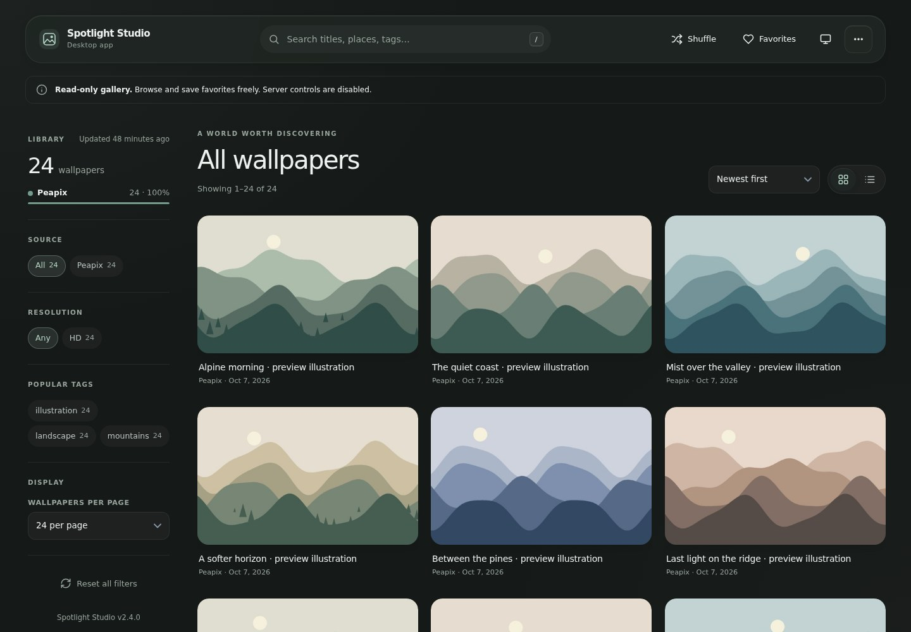
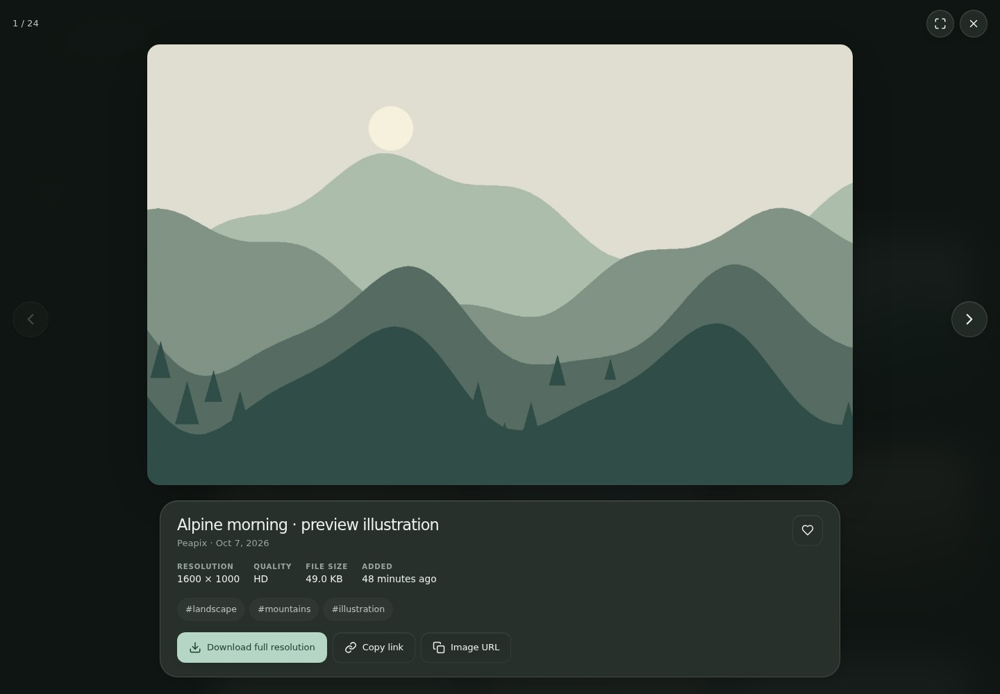
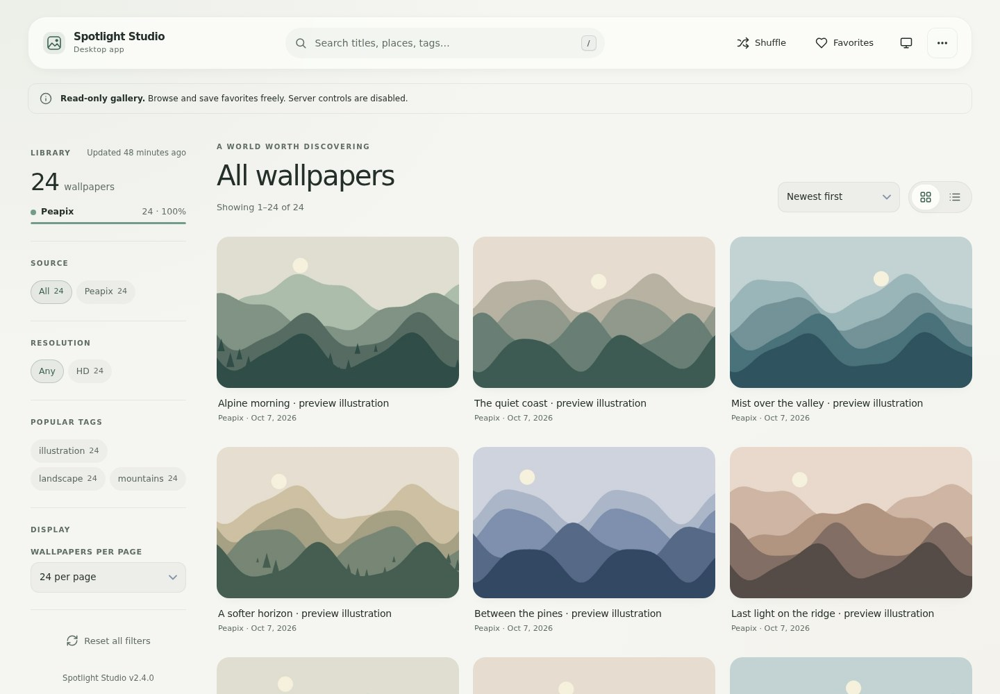
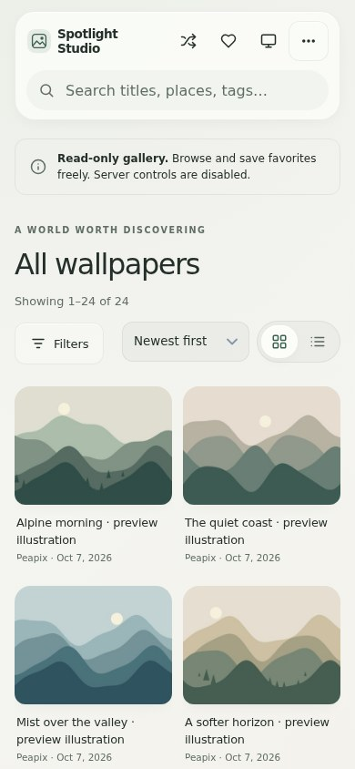

# Spotlight Studio

**An archive and gallery of Windows Spotlight wallpapers** — crawl them from Peapix and Windows10Spotlight, de-duplicate them by perceptual hash, keep the best resolution of every picture and browse the whole collection in a fast "Liquid Glass" web UI, either as a static GitHub Pages showcase or as a desktop app with crawler controls.

[](https://github.com/KetanDutt/SpotlightStudio/actions/workflows/ci.yml)




| Viewer | Light theme | Mobile |
|:---:|:---:|:---:|
|  |  |  |

<sub>The screenshots are rendered with generated placeholder images, not with the real wallpapers.</sub>

---

## Highlights

| | |
|---|---|
| 🖼️ **~7,500 wallpapers** | 4K (Peapix) and Full HD (Windows10Spotlight), perceptually de-duplicated; the best resolution of each picture wins |
| ⚡ **Fast** | 32 parallel downloads, one CPU job per image, atomic file writes; a 4 MB catalog (0.8 MB gzipped) that is parsed once and searched in memory in ~5 ms |
| 🛡️ **Reliable** | queue items are *claimed*, never lost on stop/crash; automatic retries; a circuit breaker for network outages; page counts are auto-discovered |
| 🔎 **Great browsing** | instant multi-term search, tag & resolution filters, favorites, shareable deep links (`#w=1234`), random wallpaper, keyboard shortcuts, light/dark theme |
| 📱 **Installable PWA** | works on phones, offline-capable, accessible (keyboard, screen-reader, reduced-motion) |
| 🤖 **Android / iOS app** | Expo client: offline search, favourites, history, **set the wallpaper on Android** (home/lock/both) with automatic rotation; on iOS it saves to Photos and guides you through the Shortcuts step ([details](docs/MOBILE.md#setting-a-wallpaper)) |
| 🔒 **Locked down** | strict CSP, Host/Origin checks on the local API, no XSS from scraped titles, CSV-injection-safe exports, DB and logs are never served |

## Three ways to use it

| Mode | What you get | How |
|---|---|---|
| **Static showcase** | browse, search, favorite, download | deploy the repository to GitHub Pages ([guide](docs/DEPLOYMENT.md)) |
| **Desktop / server** | everything above **plus** crawler controls, live progress, repair tools, *Set as wallpaper*, full exports | run the app locally |
| **Mobile app** | the same catalog on Android/iOS with favourites, history and offline search — and real *set wallpaper* plus background rotation on Android | `cd mobile && npm ci && npm start` ([guide](docs/MOBILE.md)) |

The same `index.html` serves the two browser modes: it detects a Spotlight Studio backend on its own origin and unlocks the crawler console when one answers. The mobile app is a separate client in `mobile/` and reads the same catalog.

## Quick start

> **Git LFS:** the wallpapers are stored in [Git LFS](https://git-lfs.com/). Install it **before** cloning (`git lfs install`), or run `git lfs pull` afterwards — otherwise every image is a 130-byte pointer file. The app warns you if that happens.

### Windows

1. Install [Python 3.10+](https://www.python.org/downloads/) (tick *Add python.exe to PATH*).
2. Double-click **`start_desktop.bat`** — it creates the virtual environment, installs the dependencies and opens the app window.

| Launcher | Purpose |
|---|---|
| `start_desktop.bat` | native window (WebView2) – falls back to your browser automatically |
| `start_server.bat` | headless server – open <http://127.0.0.1:8765/> |
| `start_update.bat` | no UI: fetch what is new and exit – schedule it daily ([how](docs/DEPLOYMENT.md#automatic-updates)) |

### Linux / macOS

```bash
git lfs install && git clone https://github.com/KetanDutt/SpotlightStudio.git && cd SpotlightStudio
python3 -m venv .venv && . .venv/bin/activate
pip install -r requirements.txt
python main.py --server            # then open http://127.0.0.1:8765/
```

(`python main.py` opens a native window where PyWebView is available and otherwise falls back to the browser. `make help` lists more shortcuts.)

## Using it

### The crawler (desktop / server mode)

Open the **Crawler** panel in the sidebar, choose a **source** and a **mode**, press **Start**:

| Mode | What it does | Typical time |
|---|---|---|
| **Quick update** | scans the newest `QUICK_UPDATE_PAGES` (3) pages of each site and fetches only what is new | seconds |
| **Full crawl** | discovers the real page count, scans every page, resumes any unfinished backlog | minutes |
| **Repair metadata** | re-reads gallery/post pages to fill in missing **titles and tags** of wallpapers you already have (no image downloads) | minutes |

Pause, resume and stop at any time — unfinished work stays in the queue. Progress, speed, queue size and a summary of the last run are shown live.

### Command line

```bash
python main.py                         # desktop window
python main.py --server [--host 0.0.0.0 --port 8765]
python main.py --crawl --mode quick    # one-shot update without UI (cron / Task Scheduler)
python main.py --crawl --mode full --source peapix
python main.py --crawl --mode repair   # back-fill titles and tags
python main.py --check                 # database ⇄ files health report (exit code 2 if problems)
python main.py --sync-catalog          # regenerate data/wallpapers.json
```

### Keyboard shortcuts

`/` search · `R` random wallpaper · `F` favorite / favorites view · `←` `→` previous / next · `C` copy link · `D` download · `Enter` fullscreen · `Esc` close · `?` help

## Configuration

Copy `.env.example` to `.env` (the Windows launchers do it for you). Everything has a sensible default and invalid values fall back to it with a warning. The most useful settings:

| Setting | Default | |
|---|---|---|
| `CONCURRENT_DOWNLOADS` | `32` | parallel image downloads |
| `QUICK_UPDATE_PAGES` | `3` | pages per site scanned by a quick update |
| `HOST` / `PORT` | `127.0.0.1` / `8765` | bind address (non-loopback ⇒ read [the security notes](docs/SECURITY.md)) |
| `VERIFY_SSL` | `true` | TLS certificate verification |

Full reference: [docs/CONFIGURATION.md](docs/CONFIGURATION.md).

## Project layout

```
main.py                 entry point (desktop window · server · crawl · check)
src/
  config.py             validated settings from .env
  database.py           SQLite layer: schema v2 migrations, claim-based queues, search, catalog
  scrapers.py           Peapix + Windows10Spotlight parsers, page discovery, title enrichment
  downloader.py         fetch → analyse (CPU pool) → de-duplicate → store
  engine.py             crawl orchestrator (quick / full / repair, pause, stop, circuit breaker)
  maintenance.py        dedupe sweep, thumbnail repair, health check, start-up tasks
  hashing.py            256-bit dHash (bit-identical to imagehash, no NumPy/SciPy)
  storage.py            file layout, atomic writes, Git-LFS pointer detection
  api.py · security.py  FastAPI app, Host/Origin checks, CSP and security headers
  wallpaper.py          set the desktop wallpaper (Windows, macOS, GNOME/KDE)
index.html              the single-page UI shell
static/                 css/app.css · js/core.js (pure logic) · js/app.js (UI) · icons/
sw.js · manifest.webmanifest   PWA
data/                   wallpapers.db (SQLite) · wallpapers.json (static catalog)
images/                 wallpapers + thumbnails (Git LFS)
tests/                  pytest suite (fake source site) + Node tests for core.js
mobile/                 Expo (React Native) app for Android & iOS – browse, search, set wallpaper
docs/                   architecture, API, configuration, deployment, mobile, security, …
scripts/                setup_env.bat (launcher helper) · make_icons.py
start_*.bat · Makefile  Windows launchers · developer shortcuts
.github/                CI workflow, Dependabot, issue / PR templates
```

## How it works (in short)

1. **Scrape** gallery pages (parsers are structure-agnostic: they rely on content patterns, not CSS class names).
2. **Queue** every unknown image URL in SQLite.
3. **Download** with up to 32 workers; decode, hash and thumbnail each image in *one* thread-pool job.
4. **De-duplicate** with a 256-bit difference hash: near-duplicates (Hamming distance ≤ 4) keep the higher resolution and merge titles/tags.
5. **Export** a compact `data/wallpapers.json` that the static site loads.

Details and diagrams: [docs/ARCHITECTURE.md](docs/ARCHITECTURE.md).

## Development

```bash
pip install -r requirements-dev.txt
pytest                                  # 200+ tests, fully offline (a fake Peapix/Win10 site)
node --test tests/js/*.test.mjs         # unit tests of the front-end logic
ruff check .

cd mobile                               # the Expo app (Node ≥ 20)
npm ci && npm run verify                # typecheck + lint + Jest (110+ tests)
npm run android                         # dev build on a device/emulator
```

Contributions are welcome — see [CONTRIBUTING.md](CONTRIBUTING.md) and [docs/DEVELOPMENT.md](docs/DEVELOPMENT.md).

## Documentation

| | |
|---|---|
| [Architecture](docs/ARCHITECTURE.md) | components, data flow, concurrency and reliability model |
| [REST API](docs/API.md) | every endpoint with examples |
| [Configuration](docs/CONFIGURATION.md) | all environment variables |
| [Deployment](docs/DEPLOYMENT.md) | GitHub Pages, local/headless use, scheduled updates, upgrading |
| [Front-end](docs/FRONTEND.md) | modules, URL parameters, CSP, service worker |
| [Mobile app](docs/MOBILE.md) | Android & iOS client: set-wallpaper capabilities, rotation, EAS builds |
| [Data formats](docs/DATA.md) | catalog JSON, database schema, normalisation rules |
| [Security](docs/SECURITY.md) | threat model and hardening |
| [Troubleshooting](docs/TROUBLESHOOTING.md) | common problems and fixes |
| [Roadmap](docs/ROADMAP.md) | suggested improvements |
| [Changelog](CHANGELOG.md) | release notes |

## License & disclaimer

© 2026 Ketan Dutt. **All rights reserved** — the repository is provided for viewing and evaluation; see [LICENSE](LICENSE) (contact in the license file for commercial use).

Spotlight Studio is an unofficial project. It is not affiliated with or endorsed by Microsoft, Peapix or Windows10Spotlight. The wallpapers remain the property of their respective copyright holders.
